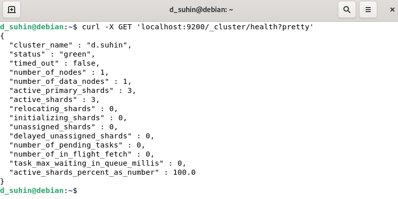
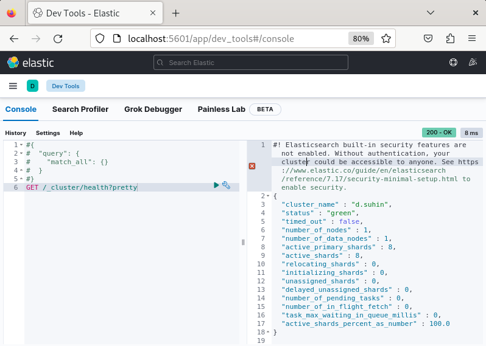
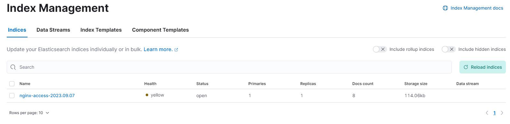
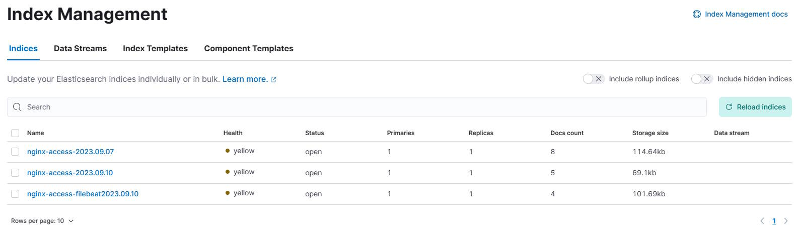

# Домашнее задание к занятию 11.3. «ELK»

### Задание 1. Elasticsearch 

Установите и запустите Elasticsearch, после чего поменяйте параметр cluster_name на случайный. 

*Приведите скриншот команды 'curl -X GET 'localhost:9200/_cluster/health?pretty', сделанной на сервере с установленным Elasticsearch. Где будет виден нестандартный cluster_name*.

## Ответ
***Примичание:*** Изначально, я начал делать без Docker Compose и соответственно без предложенных контейнеров ~~(потому что я слепой)~~, о чем потом сильно пожалел, т.к. там почти все уже было прописано.



---
### Задание 2. Kibana

Установите и запустите Kibana.

*Приведите скриншот интерфейса Kibana на странице http://<ip вашего сервера>:5601/app/dev_tools#/console, где будет выполнен запрос GET /_cluster/health?pretty*.

## Ответ
Настроил ```nano /etc/kibana/kibana.yml``` 
```yml
server.host: "0.0.0.0"
elasticsearch.hosts: ["http://localhost:9200"]
```

---

### Задание 3. Logstash

Установите и запустите Logstash и Nginx. С помощью Logstash отправьте access-лог Nginx в Elasticsearch. 

*Приведите скриншот интерфейса Kibana, на котором видны логи Nginx.*


## Ответ
Спустя пару часов ада:



---
### Задание 4. Filebeat. 

Установите и запустите Filebeat. Переключите поставку логов Nginx с Logstash на Filebeat. 

*Приведите скриншот интерфейса Kibana, на котором видны логи Nginx, которые были отправлены через Filebeat.*

## Ответ
<details>
<summary>nginx-log.conf in conf.d</summary>

```yml
input {
  file {
    path => "/var/log/nginx/access.log"  # Путь к файлу логов Nginx
    start_position => "beginning"
    sincedb_path => "/dev/null"
    type => "nginx-access"
  }
  beats {
    port => 5044
    type => "nginx-access-filebeat"
  }
}

filter {
  if [type] == "nginx-access" {
    grok {
      match => { "message" => "%{COMBINEDAPACHELOG}" }
    }
    date {
      match => [ "timestamp", "dd/MMM/yyyy:HH:mm:ss Z" ]
      target => "@timestamp"
    }
  }
  if [type] == "nginx-access-filebeat" {
    grok {
        match => { "message" => "%{IP:client} %{WORD:method} %{URIPATHPARAM:request} %{NUMBER:bytes} %{NUMBER:duration}" }
    }

  }

}

output {
  if [type] == "nginx-access" {
    elasticsearch {
      hosts => ["192.168.0.181:9200"]  # Адрес Elasticsearch, куда отправлять логи
      index => "nginx-access-%{+YYYY.MM.dd}"
    }
  }
  if [type] == "nginx-access-filebeat" {
    elasticsearch {
      hosts => ["192.168.0.181:9200"]  # Адрес Elasticsearch, куда отправлять логи
      index => "nginx-access-filebeat%{+YYYY.MM.dd}"
    }
  }
  stdout {
    codec => rubydebug
  }
}
```
</details>

<details><summary>filebeat.yml</summary>

```yml
filebeat.inputs:
- type: log
  id: my-filestream-id
  enabled: true
  paths:
      - /var/log/nginx/access.log
      - /var/log/nginx/error.log
output.logstash:
  hosts: ["192.168.0.181:5044"]
```

</details>


